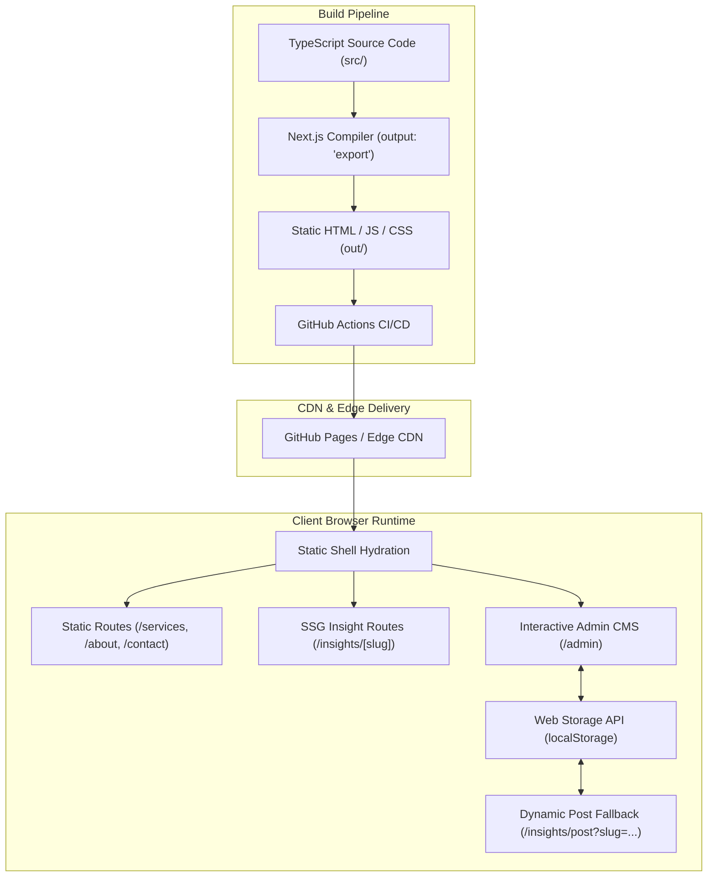

# System Architecture

**Product:** Acovate Web Platform  
**Architecture Style:** Static Site Generation (SSG) + Client-Side Dynamic Hybrid  
**Framework:** Next.js 14 (App Router)  
**Language:** TypeScript (Strict Mode)  
**Hosting Target:** GitHub Pages / Cloudflare Pages / Vercel Edge  
**Last Updated:** October 2026  

---

## 1. Technology Stack

| Layer | Technology | Version | Purpose |
| :--- | :--- | :--- | :--- |
| **Framework** | Next.js (App Router) | `14.2.20` | Server/static page generation, routing, layout nesting, metadata engine. |
| **Runtime / Library** | React & React DOM | `18.3.1` | Declarative UI rendering, hooks, component state management. |
| **Language** | TypeScript | `5.7.2` | Compile-time type safety, interface contracts, strict null checking. |
| **Styling Engine** | Tailwind CSS | `3.4.16` | Utility-first responsive CSS styling with custom theme extensions. |
| **CSS Processing** | PostCSS & Autoprefixer | `8.4.49` / `10.4.20` | Vendor prefixing and CSS transformation pipeline. |
| **Component Primitives** | Class Variance Authority (CVA) | `0.7.1` | Variant-driven type-safe component design (buttons, badges). |
| **Class Utilities** | `clsx` & `tailwind-merge` | `2.1.1` / `2.5.5` | Conditional class composition with duplicate conflict resolution. |
| **Iconography** | Lucide React | `0.468.0` | Accessible, lightweight SVG vector icons. |
| **CI / CD Deployment** | GitHub Actions | `deploy.yml` | Automated production build and artifact upload to GitHub Pages. |

---

## 2. High-Level Architecture

The Acovate platform is engineered as an **optimized Static Site Generation (SSG)** architecture that produces zero-runtime-server static HTML, CSS, and client-side JavaScript bundles.



### Architectural Highlights
- **Decoupled Static Shell**: All core marketing, service deep-dives, legal, and pre-seeded editorial insights are pre-rendered into static HTML during build time (`npm run build`).
- **Client-Side Data Persistence**: Articles created via the administrative CMS are written directly to the client browser's `localStorage` and synchronized via custom DOM events, allowing rich authoring without needing an active Node.js server.
- **Dynamic Routing Fallback**: For newly authored articles created post-build, the platform provides `/insights/post?slug=...` which queries the client storage layer directly.

---

## 3. Project & Folder Structure

```
D:\Agency\
├── .github/
│   └── workflows/
│       └── deploy.yml              # GitHub Actions automated build & Pages deployment
├── docs/                           # Central project documentation & AI persistent memory
│   ├── PRD.md                      # Product Requirements Document
│   ├── ARCHITECTURE.md             # Technical Architecture Specification (This file)
│   ├── RULES.md                    # AI Coding Rules & Engineering Standards
│   ├── DESIGN.md                   # UI/UX Design System Specification
│   ├── TASKS.md                    # Implementation Roadmap & Task Tracker
│   └── MEMORY.md                   # Persistent AI Project Memory & Context
├── public/                         # Static public assets
│   ├── images/
│   │   └── hero-agency.jpg         # Primary marketing photography asset
│   └── .nojekyll                   # Bypasses Jekyll processing on GitHub Pages
├── src/
│   ├── app/                        # Next.js App Router (Routes & Layouts)
│   │   ├── globals.css             # Tailwind base layers, CSS variables, custom scrollbars
│   │   ├── icon.svg                # Dynamic SVG favicon
│   │   ├── layout.tsx              # Root HTML layout with Navbar, Footer & WhatsApp button
│   │   ├── page.tsx                # Homepage composition
│   │   ├── manifest.ts             # Web App Manifest generator
│   │   ├── robots.ts               # Robots.txt crawler directives generator
│   │   ├── sitemap.ts              # Dynamic XML sitemap generator
│   │   ├── about/page.tsx          # About page (mission, values, milestones)
│   │   ├── admin/page.tsx          # Editorial admin panel route
│   │   ├── contact/page.tsx        # Direct contact & communication hub
│   │   ├── insights/
│   │   │   ├── page.tsx            # Technical insights listing & search hub
│   │   │   ├── [slug]/page.tsx     # Static SSG individual article viewer
│   │   │   └── post/page.tsx       # Dynamic query-parameter fallback viewer
│   │   ├── privacy/page.tsx        # Privacy policy legal document
│   │   ├── services/page.tsx       # 11-discipline services directory
│   │   └── terms/page.tsx          # Terms of service legal document
│   ├── components/                 # Reusable React components
│   │   ├── admin/
│   │   │   ├── AdminClient.tsx     # Admin dashboard, auth state & article list
│   │   │   └── WordEditor.tsx      # MS Word-style rich text WYSIWYG editor
│   │   ├── insights/
│   │   │   ├── BlogPostClient.tsx  # Dual-mode article renderer (SSG + storage)
│   │   │   └── InsightsClient.tsx  # In-memory search & category filter interface
│   │   ├── layout/
│   │   │   ├── Footer.tsx          # Global site footer with service taxonomy
│   │   │   ├── JsonLd.tsx          # Schema.org structured data emitter
│   │   │   ├── Navbar.tsx          # Responsive sticky navigation bar
│   │   │   └── WhatsAppButton.tsx  # Floating quick-inquiry widget
│   │   ├── sections/
│   │   │   ├── CaseStudiesSection.tsx       # Proven customer metrics
│   │   │   ├── CtaBanner.tsx                # High-converting lead generation banner
│   │   │   ├── HeroSection.tsx              # Homepage hero with trust indicators
│   │   │   ├── ProcessSection.tsx           # 4-stage engineering methodology
│   │   │   ├── ProjectScopeCalculator.tsx   # Interactive scoping & timeline estimator
│   │   │   ├── ServicesOverviewSection.tsx  # Filterable capabilities overview
│   │   │   └── TestimonialsSection.tsx      # Executive client proof
│   │   ├── services/
│   │   │   └── ServicesClient.tsx  # Detailed service matrix, search & FAQs
│   │   └── ui/                     # Design system primitive components
│   │       ├── badge.tsx           # Type-safe badge variant
│   │       ├── button.tsx          # Type-safe button variant (cva)
│   │       ├── card.tsx            # Modular card container primitives
│   │       ├── input.tsx           # Styled text input primitive
│   │       └── service-icon.tsx    # Dynamic Lucide icon mapper
│   ├── data/                       # In-memory typed domain datasets
│   │   ├── insightsData.ts         # Pre-seeded engineering technical articles
│   │   └── servicesData.ts         # Complete 11-service domain taxonomy & metadata
│   └── lib/                        # Shared utility functions and storage adapters
│       ├── insightsStorage.ts      # Web Storage API adapter & HTML-to-section parser
│       └── utils.ts                # Class name merger (`cn`), basePath resolver (`getAssetPath`)
├── next.config.mjs                 # Next.js export & basePath configuration
├── package.json                    # Project dependencies & operational scripts
├── postcss.config.mjs              # PostCSS plugins setup
├── tailwind.config.ts              # Tailwind design tokens, colors & keyframes
└── tsconfig.json                   # TypeScript compiler configuration
```

---

## 4. Frontend Architecture

### 4.1 Rendering Model: Next.js App Router (SSG)
- **Static Export (`output: "export"`)**: Configured in `next.config.mjs`. All static routes are pre-rendered into standalone `.html` files in `/out`.
- **Static Route Generation (`generateStaticParams`)**:
  Used in `src/app/insights/[slug]/page.tsx` to pre-generate all static article pages from `INSIGHTS_DATA` at build time.
- **Client Fallback Route (`src/app/insights/post/page.tsx`)**:
  Enclosed inside a `<Suspense>` boundary to safely read `useSearchParams()`. Resolves articles authored in the browser that were not present during the build.

### 4.2 Component Architecture & Hierarchy
Components follow a strict separation of concerns:
1. **App Route Pages (`src/app/**/page.tsx`)**: Server Components (where possible) responsible for setting route-specific `Metadata` and injecting JSON-LD schemas.
2. **Feature Clients (`*Client.tsx`)**: Client Components marked with `"use client"` that encapsulate state, animations, search filters, and browser events.
3. **Presentational Sections (`src/components/sections/`)**: Composable landing page blocks that consume data and render structured markup.
4. **UI Primitives (`src/components/ui/`)**: Reusable atomic building blocks (Button, Badge, Card, Input) built with `class-variance-authority`.

---

## 5. Backend Architecture & Persistence

### Current State: Serverless Static Architecture
Because the application is configured for pure static export (`output: "export"`), there are currently **no running Node.js server processes or API route handlers** in production.

### Data Layer: In-Memory Datasets + LocalStorage Adapter
1. **Static Datasets (`src/data/`)**:
   - `servicesData.ts`: Central registry of all 11 services, categories, process steps, case studies, and testimonials.
   - `insightsData.ts`: Strongly typed array of pre-seeded technical perspectives, whitepapers, and benchmark stats.
2. **Client Storage Layer (`src/lib/insightsStorage.ts`)**:
   - Uses browser `window.localStorage` under the storage key `acovate_insights_v1`.
   - Emits and listens to `CustomEvent("insights_updated")` across window instances.
   - Converts rich HTML from the WYSIWYG editor into structured `TechnicalSection[]` models and vice-versa.
3. **Future Backend Migration Path (TBD)**:
   - When multi-user cloud publishing is required, an external BaaS (e.g. Supabase, PostgreSQL + Prisma, or Sanity Headless CMS) can be connected via REST/GraphQL webhooks.

---

## 6. Authentication & Authorization

### High-Security Editorial Access Control (`src/lib/adminSecurity.ts`)
- **Cryptographic Verification**: Native Web Crypto API (`window.crypto.subtle`) SHA-256 salted hashing with zero plaintext credentials in source code.
- **Strict 1-Hour Session Cookie**: Issued as `acovate_admin_session_v1` with `Max-Age=3600`, `SameSite=Strict`, `Secure` (on HTTPS), and signed HMAC payload verifying `token`, `email`, `issuedAt`, `expiresAt`, and `fingerprint`.
- **Anti-Brute-Force Rate Limiter**:
  - Sliding-window tracking with progressive 30-second penalty delay after 3 failed attempts.
  - Complete 15-minute lockout after 5 failed attempts with real-time countdown display.
- **Session Hijacking Defense**: Browser environment fingerprinting (User-Agent, screen resolution, time zone) cryptographically bound to session signatures.
- **Honeypot Anti-Bot Shield**: Invisible bot-trap input field that instantly rejects and locks automated credential stuffing.
- **Session Expiry & Auto-Logout**: Real-time header countdown timer with warning alerts and automated cookie destruction when the 1-hour lifecycle expires.
- **Master Password Updating**: Built-in credential management modal allowing administrators to update passwords with newly salted SHA-256 hashes.

---

## 7. Routing & Base Path Resolution

Because the platform can be deployed either to custom apex domains (`acovate.agency`) or GitHub Pages sub-paths (`username.github.io/Smarter-world`), the system includes dynamic path resolution:

```typescript
// next.config.mjs
const isProd = process.env.NODE_ENV === "production";
const repoName = "Smarter-world";

const nextConfig = {
  output: "export",
  basePath: process.env.NEXT_PUBLIC_BASE_PATH || (isProd ? `/${repoName}` : ""),
  assetPrefix: process.env.NEXT_PUBLIC_BASE_PATH || (isProd ? `/${repoName}/` : ""),
  trailingSlash: true,
  images: { unoptimized: true },
};
```

All image paths, static assets, and links utilize `getAssetPath()` in `src/lib/utils.ts` to ensure zero broken assets regardless of hosting environment.

---

## 8. SEO & Structured Data Architecture

Acovate implements a comprehensive technical SEO architecture:

```
[Google / Bing Crawler]
       │
       ├──> robots.txt (src/app/robots.ts)
       │       └── Allows all public routes, points to sitemap.xml
       │
       ├──> sitemap.xml (src/app/sitemap.ts)
       │       └── Generates static priority-weighted URLs for all routes & slugs
       │
       ├──> manifest.webmanifest (src/app/manifest.ts)
       │       └── PWA Progressive Web App installability configuration
       │
       └──> HTML <head> Injections
               ├── Canonical URLs & OpenGraph meta tags
               └── JSON-LD Schema (Organization, WebSite, ProfessionalService, BlogPosting)
```

---

## 9. Error Handling & Resilience

1. **Not Found Handler (`src/app/_not-found`)**: Default Next.js 404 handler pre-rendered at build time.
2. **Missing Article Fallback**: If an unknown slug is requested in `BlogPostClient.tsx`, a styled empty state is rendered with an immediate return button to `/insights`.
3. **Storage Fallback**: If `localStorage` access fails (e.g. disabled cookies, incognito mode), `insightsStorage.ts` catches the exception and returns the static `INSIGHTS_DATA` fallback without crashing.
4. **Suspense Boundaries**: Dynamic route components utilizing query parameters (`useSearchParams`) are isolated inside `<Suspense>` boundaries to satisfy Next.js static build requirements.

---

## 10. Scalability & Performance Considerations

1. **Zero Server Overhead**: Static export offloads 100% of compute to edge CDN nodes, allowing virtually infinite concurrency with near-zero hosting costs.
2. **CSS Atomic Tree-Shaking**: Tailwind CSS purges all unused styles during compilation, maintaining the total global CSS bundle under 15 kB.
3. **Dynamic Font & SVG Optimization**: Lucide icons are imported individually to enable strict tree-shaking and avoid bundle bloat.
4. **Clean Asset Caching**: CDN caches static HTML and hashed JS chunks (`/_next/static/...`) with immutable cache-control headers.

---

## 11. Security Considerations

- **No Server Vulnerability Surface**: With no server runtime, common vulnerabilities like SSRF, remote code execution (RCE), or Node server memory leaks are eliminated.
- **Client-Side Input Sanitization**: Admin rich text input is parsed into structured objects before storage.
- **Content Security**: All external links utilize `rel="noopener noreferrer"` to protect against tab-nabbing.
- **Robots Disallow Directives**: Internal routes (`/api/`, `/private/`) and admin pages are flagged with `noindex, nofollow` metadata.

---

## 12. Important Architectural Decisions (ADR Summary)

- **ADR-01 (Static Export)**: Chose `output: "export"` for universal edge compatibility and instantaneous response times.
- **ADR-02 (Hybrid Article Routing)**: Implemented dual routing (`[slug]` for SSG + `post?slug=` for client-side storage) to permit in-browser article authoring without requiring a full redeployment.
- **ADR-03 (Tailwind Design System)**: Selected Tailwind with a custom palette (Linen `#dbd8cf` + Forest Green `#093103`) over generic component libraries to deliver an editorial aesthetic.
- **ADR-04 (Zero Bloat Icons)**: Chose `lucide-react` with a custom `ServiceIcon` switch mapper to keep SVG bundle sizes minimal.
